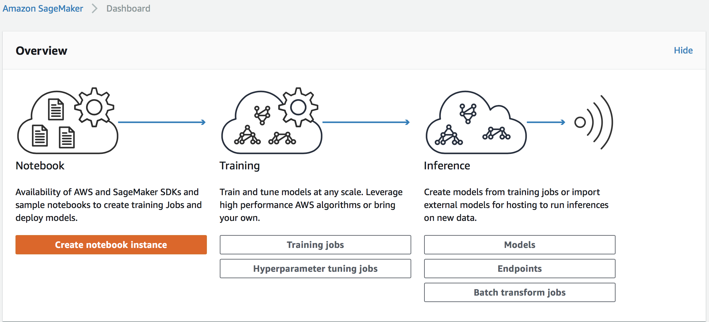
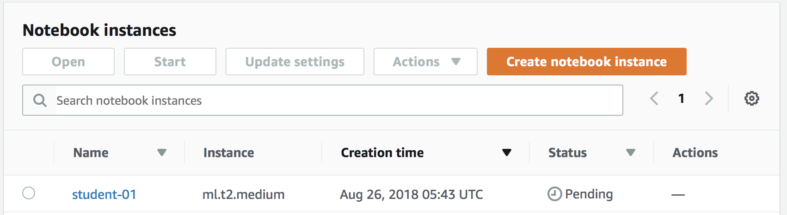
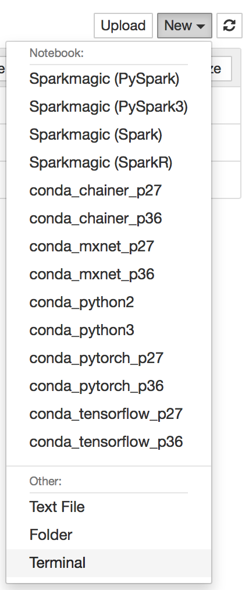
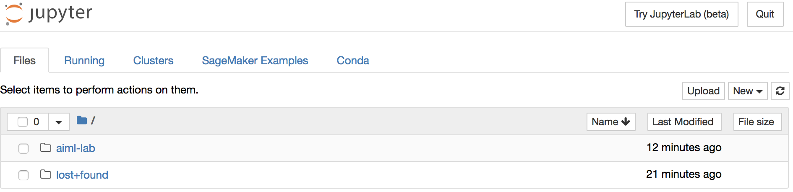
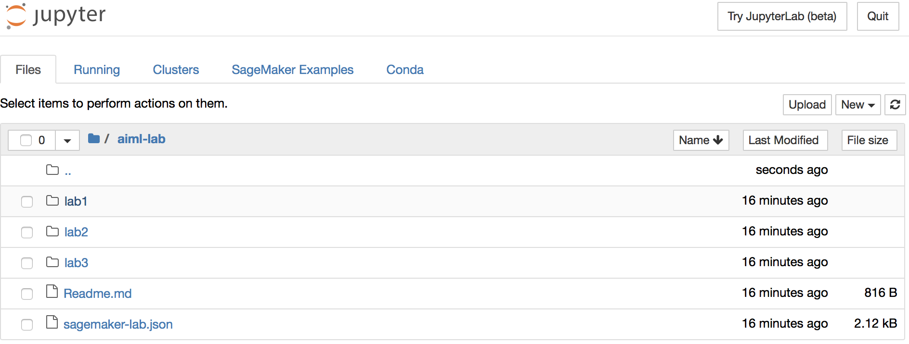

# Lab 1: AI Services

In this lab, we will explore AI services for Rekognition, Comprehend, Polly and Lex.

## Pre-requisite

You have an active AWS account with credits and permissions to run sagemaker jobs.  We will spin up the following resources:

* `ml.t2.medium` notebook instance  

## Steps

Following is a list of steps for training and deploying a machine learning model with Amazon Sagemaker.

  1. [Create Notebook Instance](#1-create-notebook-instance)
  2. [Launch Terminal](#2-launch-terminal)
  3. [Clone notebook](#3-clone-notebook)
  4. [Open notebook](#4-open-notebook)

### 1. Create Notebook Instance

Open Amazon Sagemker in the AWS console in the `us-east-1` (N. Virginia) region, then click **Create notebook instance** button.



Specify the notebook details

* Name the notebook eg: `student-01`
* For the IAM role select the existing `AmazonSagemaker-ExecutionRole`
* Leave the remaining defaults and click **Create notebook instance**


Your notebook will be pending, once it is ready you can click **open** which will redirect to to your new notebook.



### 2. Launch Terminal

In the open Jupyter notebook, click the `New` drop down in top right hand corner:



Then click `Terminal` to launch a new window with a SSH window at the root for the `ec2-user`

### 3. Clone notebook

Navigate to the *SageMaker* folder which is the root folder for all your Jupyter
notebooks and clone the GitHub repository `https://github.com/brightsparc/aiml-lab.git`.

```bash
cd SageMaker
git clone https://github.com/brightsparc/aiml-lab.git
```

### 4. Open notebook

You can navigate to the previous *SageMaker Files* tab in the Jupyter notebook and open the `aiml-lab` folder



Then open the `lab1` folder:



You can now launch each of the notebooks to work through this lab:

1. [Rekognition_Demo.ipynb](./Rekognition_Demo.ipynb) - Explore image classification and face recogition.
2. [Lex_CreateBot_Demo.ipynb](./Lex_CreateBot_Demo.ipynb) - Create the Lex Chat Bot
3. [Lex_Demo.ipynb](./Lex_Demo.ipynb) - Exercise the Lex chat bot
4. [Polly_Demo.ipynb](./Polly_Demo.ipynb) - Turn text into speech and back again with Transcribe.
5. [Comprehend_Demo.ipynb](./Comprehend_Demo.ipynb) - Analyse sentiment and entities from twitter including Translating content.
